# Analyse de Sentiments grâce au Deep Learning avec l'approche MLOps

> Cet article est disponible en ligne : [Blog](https://github.com/Aragor85/mlflow_project/blob/analyse_sentiments/docs/Analyse_de_sentiments.md)


*Cet article a été rédigé dans le cadre du projet : Réalisez une analyse de sentiments grâce au Deep Learning du parcours [AI Engineer](https://openclassrooms.com/fr/paths/795-ai-engineer). Les données utilisées sont issues du jeu de données open source [Sentiment140](https://www.kaggle.com/datasets/kazanova/sentiment140). Le code source complet est disponible sur [(https://github.com/Aragor85/mlflow_projectGitHub)]*

> 🎓 OpenClassrooms • Parcours [AI Engineer](https://openclassrooms.com/fr/paths/795-ai-engineer) | 👋 *Étudiant* : Djamel FERGUEN


## 🌐 Contexte et problématique métier 

Ce projet s'inscrit dans un scénario professionnel où j'interviens en tant qu'ingénieur IA chez MIC (Marketing Intelligence Consulting), entreprise de conseil spécialisée sur les problématiqus de marketing digital.

Notre client,  **Air Paradis** (compagnie aérienne), souhaite **anticiper les bad buzz sur les réseaux sociaux**. La mission consiste à développer un produit IA permettant de prédire le sentiment associé à un tweet, afin d'améliorer son image de marque en ligne.

## ⚡ Mission

> Développer un modèle d'IA permettant de prédire le sentiment associé à un tweet.

Créer un prototype fonctionnel d'un modèle d'analyse de sentiments pour tweets selon trois approches différentes :

1. **Modèle simple** : Approche classique (régression logistique,Randomforest,LightGBM) pour une prédiction rapide
2. **Modèle avancé** : Utilisation de réseaux de neurones profonds avec différents word embeddings ( USE, Bidirectional_LSTM et BERT)
3. **Modèle avancé BERT** : Le modèle BERT est bien intégré dans le projet. Cependant, en raison de limitations matérielles (notamment l'absence de GPU et une configuration uniquement sur CPU), l'entraînement s'est avéré extrêmement lent. Face à un temps de calcul estimé à 10 heures par Epoch, j'ai décidé d'interrompre l'exécution du modèle

Cette mission implique également la mise en place d'une **démarche MLOps complète pour le deploiment sur le Cloud** :

- Utilisation de **MLFlow pour le tracking des expérimentations et le stockage des modèles**.
- Création d'un **pipeline de déploiement continu (Git + Github + plateforme Cloud Azure)**.
- Intégration de **tests unitaires automatisés**.
- Mise en place d'un **suivi de performance du modéle en production** via Azure A[pplication Insight](https://learn.microsoft.com/fr-fr/azure/azure-monitor/app/app-insights-overview).

## 🔧 Environnement technique

- **Distribution** : Anaconda
- **Langages** : Python ver. 3.10
- **Bibliothèques ML/DL** : Scikit-learn, TensorFlow/Keras, Transformers
- **MLOps** : MLFlow, Git, GitHub Actions
- **Backend** : FastAPI
- **Frontend** : Streamlit   
- **Monitoring** : Azure Application Insight
- **Traitement texte** : NLTK, Word Embeddings

## 🏛️ Structure du projet

```
```

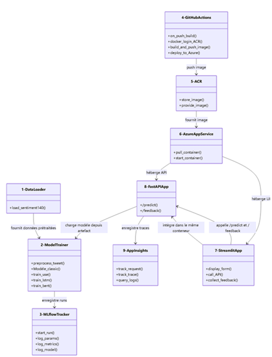


## 📑 Méthodologie et données

### Le jeu de données Sentiment140

Pour ce projet, nous avons utilisé le jeu de données open source Sentiment140, qui contient 1,6 million de tweets annotés (négative ou positive). Ce dataset comprend six champs principaux :

- **target** : la polarité du tweet (0 = négatif, 1 = positif)
- **ids** : l'identifiant du tweet
- **date** : la date du tweet
- **flag** : une requête éventuelle
- **user** : l'utilisateur ayant posté le tweet
- **text** : le contenu textuel du tweet

J'ai choisi de réduire la taille du dataset a 16 000 tweets pour la suite du projet en raison de limitations matérielles (notamment l'absence de GPU et une configuration uniquement sur CPU), l'entraînement s'est avéré extrêmement lent.

### Analyse exploratoire des données Sentiment140

Notre analyse exploratoire a révélé des caractéristiques distinctives importantes entre les tweets positifs et négatifs :

- 50% de tweets positifs
- 50% de tweets négatifs

équilibrés pas de smote 

### Prétraitement des données textuelles

Dans ce projet, le prétraitement des données textuelles est une étape essentielle pour garantir des prédictions fiables. Il consiste à nettoyer les tweets en supprimant les caractères spéciaux, les URLs, les mentions et les stop words. Les textes sont ensuite normalisés (minuscules, lemmatisation) pour réduire la variance linguistique. Cette étape permet d’obtenir des représentations textuelles plus cohérentes avant l’entraînement des modèles de classification.
 
## 🧠 Approches de modélisation

Pour répondre à la demande d'Air Paradis, nous avons développé et comparé 5 approches de modélisation distinctes, de la plus simple à la plus avancée.

### Modèle classique
- Logistic regression
- Randomforest
- LightGBM

Notre première approche s'est basée sur des techniques classiques de machine learning, combinant une vectorisation du texte avec un classifieur traditionnel :

1. **Vectorisation** : transformation des textes en représentations numériques via TF-IDF (Term Frequency-Inverse Document Frequency)
2. **Classification** : utilisation d'un Randomforest,LightGBM ou Régression Logistique pour prédire le sentiment

Cette approche présente plusieurs avantages :
- Rapidité d'entraînement et d'inférence
- Faible empreinte mémoire
- Bonne interprétabilité des résultats

Malgré sa simplicité, ce modèle a atteint une précision (accuracy) de 73% sur notre jeu de test, ce qui constitue une base solide pour la détection de sentiments.

### Modèles avancé (réseaux de neurones avec word embeddings)

**Universal Sentence Encoder (USE)** : Le modèle USE encode des phrases en vecteurs de grande dimension capturant leur sens global. Il est rapide, léger et bien adapté aux tâches de classification de texte avec peu de ressources.

**Bidirectional LSTM (BiLSTM)** Le BiLSTM traite les séquences de mots dans les deux directions (avant et arrière), capturant ainsi le contexte complet d’une phrase. Il est particulièrement performant pour comprendre la structure grammaticale des textes.

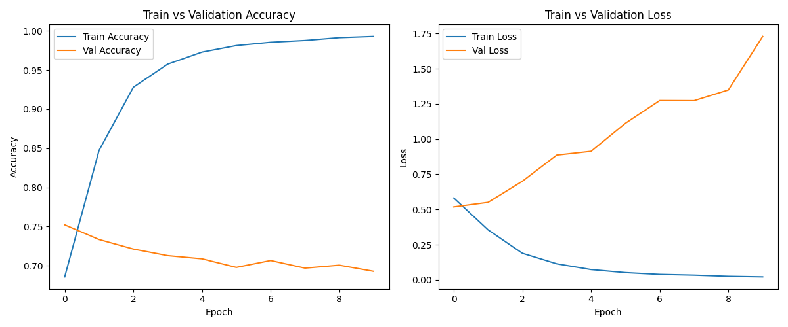

**DistilBERT**: DistilBERT est une version plus légère de BERT, conservant 95 % de sa performance tout en étant plus rapide. Il est entraîné sur des milliards de mots, ce qui le rend très précis pour l’analyse de sentiments.

### Comparaison des performances des modèles

Voici un récapitulatif des performances obtenues avec nos différentes approches :

| Modèle | Accuracy |F1-Score | AUC | Temps d'entraînement |
|--------|----------|---------|-----|----------------------|
| Randomforest + TF-IDF | 0,71 | 0,73% | 0,79 | 34 secondes |
| Régression Logistique + TF-IDF | 0,71  | 0,70 | 0,77 | 10 secondes |
| LightGBM + TF-IDF | 0,73 | 0,74 | 0,81 | 13 secondes |
| USE | 0,77 | 0,75 | 0,85 | 24 secondes |
| Bidirectional_LSTM | 0,71 | 0,72 | 0,77 | 14,5 min |
| BERT | -- | -- | -- | ~40 heures |

## ⚙️ Mise en œuvre du MLOps

### Principes du MLOps

**Le MLOps (Machine Learning Operations) est une méthodologie qui vise à standardiser et à automatiser le cycle de vie des modèles de machine learning**, de leur développement à leur déploiement en production. Pour ce projet, nous avons mis en œuvre plusieurs principes clés du MLOps :

1. **Reproductibilité** : environnement de développement versionné et documenté
2. **Automatisation** : pipeline de déploiement continu
3. **Monitoring** : suivi des performances du modèle en production
4. **Amélioration continue** : collecte de feedback et réentraînement périodique

Cette approche nous a permis de créer une solution robuste et évolutive pour Air Paradis.

### Tracking des expérimentations avec MLFlow

Pour assurer une gestion efficace des expérimentations, nous avons utilisé [MLFlow](https://mlflow.org/docs/latest/index.html), un outil open-source spécialisé dans le **suivi et la gestion des modèles de machine learning** :

1. **Tracking des métriques** : pour chaque expérimentation, nous avons enregistré automatiquement les paramètres du modèle, les métriques de performance (accuracy, F1-score, précision, rappel) et les artefacts générés
2. **Centralisation des modèles** : tous les modèles entraînés ont été stockés de manière centralisée avec leurs métadonnées
3. **Visualisation** : l'interface utilisateur de MLFlow nous a permis de comparer visuellement les différentes expérimentations


Cette approche nous a permis de tracer l'évolution de nos modèles et de sélectionner le plus performant pour le déploiement.

Pour le déploiement en production, nous avons retenu le modèle **USE**, qui offre le meilleur compromis entre performance et ressources requises. Et plus adapté à un déploiement sur une infrastructure Cloud gratuite.

## 💻 Interface utilisateur

### Architecture de l'application

Pour l'interfacage j'ai choisi FastAPI en Backend, car il est est rapide, moderne, et facile à intégrer avec des modèles ML grâce à son support natif.


### Fonctionnalités de l'interface Backend

- **Backend (FastAPI)** :
   - API REST exposant le modèle d'analyse de sentiments
   - Endpoints pour la prédiction individuelle et par lots
   - Système de feedback et de monitoring
   - Téléchargement automatique des artefacts du modèle depuis MLFlow

  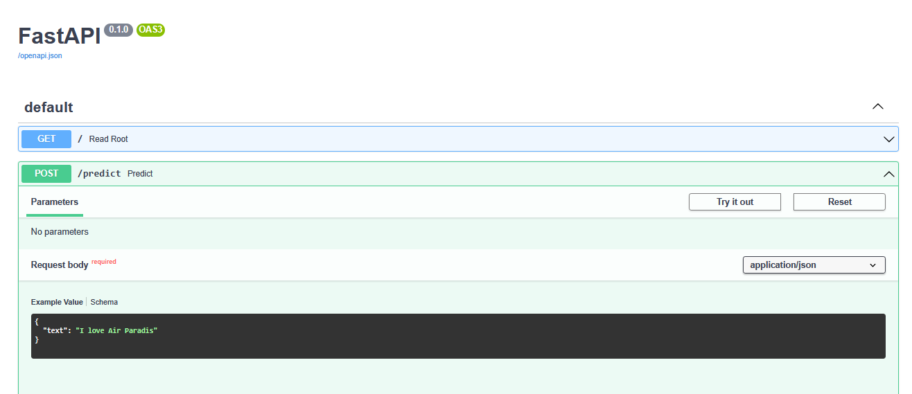
  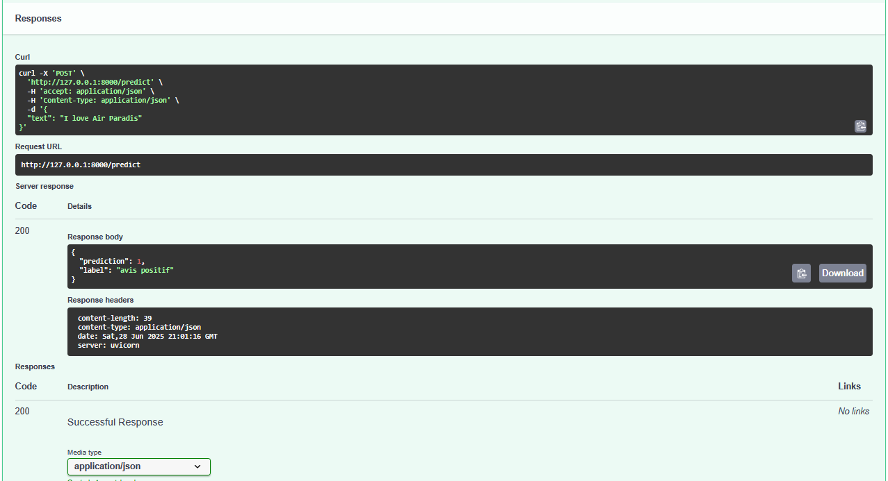


### Fonctionnalités de l'interface utilisateur

**Streamlit** est parfait pour l’interface utilisateur,car il permet de créer rapidement des applications web interactives en Python. Il s’intègre facilement avec les modèles ML pour afficher prédictions, graphiques et résultats en temps réel.

  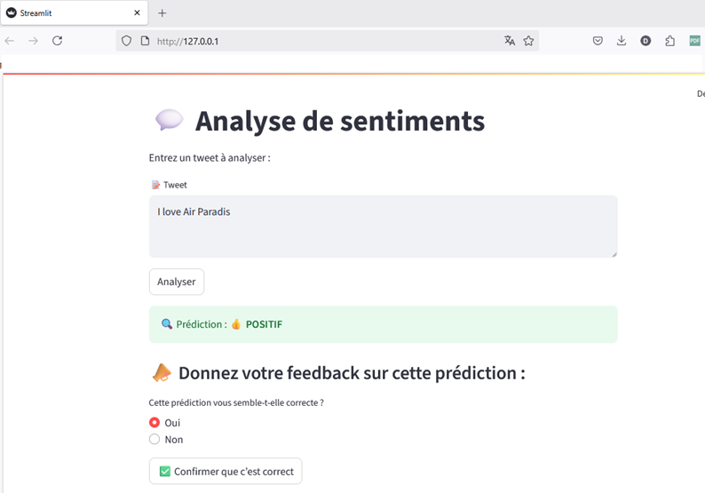


## 🔄 Pipeline de déploiement continu

Pour automatiser le déploiement de notre modèle, nous avons mis en place un **pipeline CI/CD (Intégration Continue / Déploiement Continu)** avec les composants suivants :

1. **Versionnement du code** : utilisation de Git pour le contrôle de version
2. **GitHub Actions** : automatisation des tests et du déploiement à chaque push sur la branche (analyse_sentiments)
3. **Déploiement sur Azure** : plateforme Cloud pour héberger notre API de prédiction de sentiments


### Tests unitaires automatisés

Pour garantir la fiabilité de notre solution, nous avons implémenté des **tests unitaires automatisés** couvrant les aspects critiques :

1. **Test du endpoint** : Vérifie que l'API répond correctement avec un code 200 et confirme que le statut retourné est "ok". Le modèle est chargé correctement.
2. **Test du endpoint de prédiction** : S'assure que l'API traite correctement les requêtes POST sur `/predict`, accepte un texte à analyser et renvoie un résultat contenant les champs "sentiment".

### GitHub Actions 

Le déploiement est entièrement automatisé grâce à **GitHub Actions** :

1. **Déclenchement** : À chaque commit/push sur la branche(analyse_sentiments), GitHub Actions lance le workflow.
2. **Tests automatisés** : Le workflow exécute tous les tests unitaires.
3. **Déploiement conditionnel** : Uniquement si les tests réussissent, l'application est déployée automatiquement sur Azure .[Test API ](https://analyse-de-sentiments.azurewebsites.net/)

#### Création du workflow GitHub Actions

Pour la création du workflow GitHub Actions, nous créons un fichier `.github/workflows/analyse_sentiments_module-7.yml`

#### Configuration des secrets GitHub

Le workflow **GitHub Actions** a besoin d'accéder aux **variables d'environnement**. Nous avons donc renseigner les "secrets" nécessaires. Dans notre dépôt GitHub, nous allons dans "Settings" > "Secrets and variables" > "Actions", puis nous cliquons sur "New repository secret". Nous ajoutons les secrets suivants:

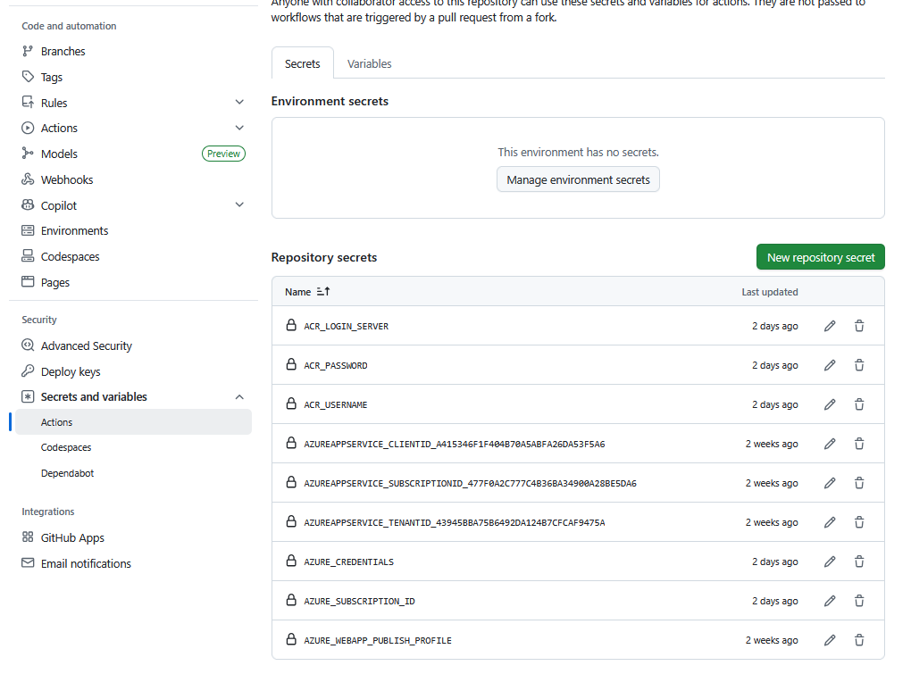


### Déploiement sur Azure

Pour le déploiement de notre solution, nous avons choisi [Azure](https://azure.microsoft.com/) pour plusieurs raisons :

1. **Plan gratuit** : conforme à la demande de limiter les coûts pour ce prototype
2. **Intégration avec GitHub** : facilite le déploiement continu avec GitHub Actions
3. **Scalabilité** : possibilité d'évoluer si le projet est approuvé pour la production

#### Configuration Azure

Notre application utilise les fichiers de configuration suivants pour Azure :

- **Procfile** : `gunicorn app.main:app --workers 1 --worker-class uvicorn.workers.UvicornWorker --bind=0.0.0.0:8000`
- **runtime.txt** : `python-3.10`
- **requirements.txt** : Liste de toutes les dépendances nécessaires

Les variables d'environnement sur Azure incluent :
- `MLFLOW_TRACKING_URI` : URI du serveur MLflow
- `RUN_ID` : Identifiant du run MLflow du modèle déployé
- `INSTRUMENTATION_KEY` : Clé pour Azure voir xxxxxxx.yml

#### Docker **Il faut parler 

pour déployer une interface utilisateur Streamlit et tout le projet sur Azure :

- **Isolation & portabilité** : un conteneur regroupe toute l'application (FastAPI + Streamlit + dépendances) dans un environnement cohérent et réutilisable.

- **Déploiement** : ACR permet de stocker et gérer les images Docker, prêtes à être déployées sur Azure App Service.

- **Compatibilité Cloud** : Azure App Service peut exécuter directement une image Docker depuis ACR, sans se soucier des dépendances.

- **Déploiement automatisé** : GitHub Actions peut builder, pousser l’image sur ACR et la déployer automatiquement.

- **Multi-services unifiés** : Streamlit (UI) et FastAPI (backend) peuvent tourner ensemble dans un même conteneur, sur un seul port exposé.

- **Scalabilité & maintenance** : plus simple de mettre à jour ou répliquer l’application avec une nouvelle version du conteneur.

### Exemple d'exécution et déploiement réussis

La capture d'écran suivante indique que le déploiement est réussi sur **Azure**.

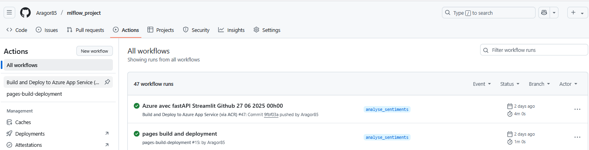
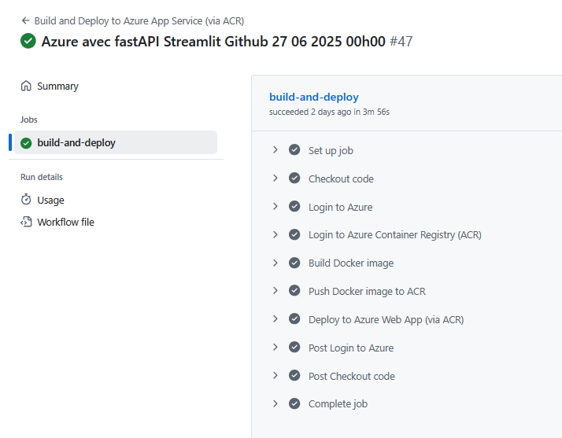


### Avantages de notre pipeline CI/CD

Notre pipeline de déploiement continu offre plusieurs avantages significatifs :

1. **Automatisation du deploiment** : chaque modification poussée sur GitHub déclenche automatiquement les étapes de test, de packaging, et de déploiement de l'API FastAPI contenant le modèle d'analyse de sentiments.
2. **Fiabilité grace aux tests automatisés** : Les tests unitaires garantissent la validité du code à chaque mise à jour.
3. **Traçabilité** : Chaque déploiement est associé a un commit Git précis pour faciliter le suivi et evolutions du modéle
4. **Feedback rapide pour les developpeurs** : en cas d'erreur des tests ou du deploiment, une notification est envoyé pour corrigier rapidement le bug


## 📡 Suivi de la performance en production

### Suivi des performances avec Azure Application Insights

Afin d'analyser le comportement de notre modèle en production, nous avons intégré Azure Application Insights pour analyser les peformances en temps réel. Cette solution nous offre :

- collecte en temps réel des métriques de performance de l’API.

- Enregistrement spécifique des actions ou erreurs liées aux prédictions du modèle.

- Tableaux de bord interactifs pour visualiser et analyser les performances sur la durée.

### Collecte de feedback utilisateur

Nous avons mis en place un système structuré de retour utilisateur permettant d’évaluer la  les prédictions si elles sont bonnes ou mauvaises :

- Chaque utilisateur peut confirmer ou infirmer la prédiction générée par le modèle.

- L'enregistrement du tweet, de la prédiction du modèle et la correction utilisateur sur l'interface Streamlit si nécessaire.

- L’ensemble des retours est centralisé dans Azure Application Insights, facilitant l’analyse et l’amélioration continue du modèle.

Pour consulter les **feedbacks de tweets incorrectement prédits**, il suffit d'exécuter la commande suivante : 


------------------------------------------------------------

------------------------------------------------------------
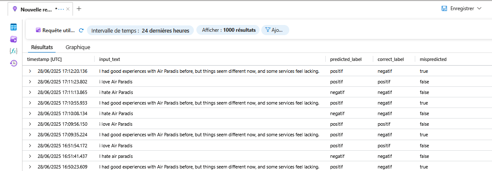

Cette méthode permet de **constituer progressivement une base d'exemples difficiles à traiter**. Ces tweets mal classifiés sont très utiles car ils révèlent **les faiblesses spécifiques du modèle**. En les collectant systématiquement, on construit **un jeu de données ciblé sur les erreurs** du modèle. Cette méthode s'inscrit dans une démarche **d’apprentissage actif (active learning)**. Elle est plus **efficace** qu’un simple ajout aléatoire de données, car elle concentre l’amélioration du modèle sur les cas **réellement problématiques**.

### Configuration des alertes automatiques

Nous avons mis en place un **système d'alertes automatiques** pour détecter les dérives de performance du modèle.
Une alerte est déclenchée si **trois erreurs de prédiction sont signalées en moins de 5 minutes**.
Lorsqu’une alerte est générée, **une notification par email** est envoyée aux responsables du projet.
Toutes les **alertes sont stocker** pour permettre une analyse a posteriori.
Ce système de **monitoring proactif** permet à l’équipe d’intervenir avant que les erreurs ne se multiplient.

<table>
  <tr>
    <td>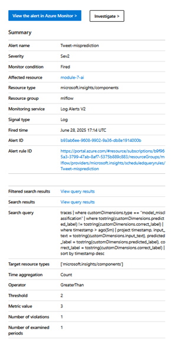</td>
    <td>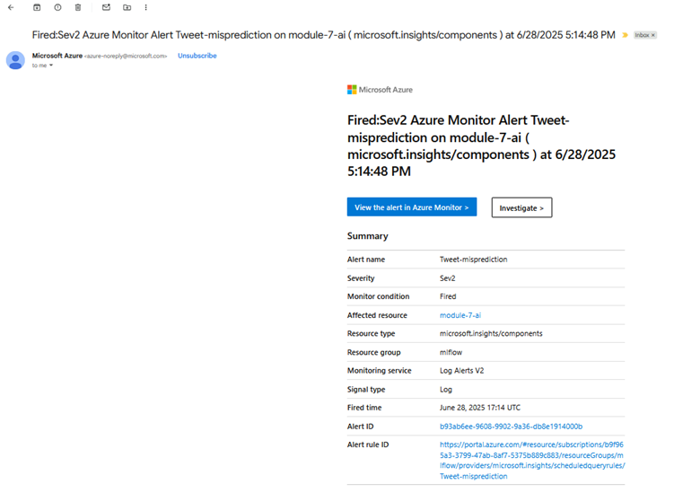</td>
  </tr>
  <tr>
    <td align="center">Alerte - Email 1</td>
    <td align="center">Alerte - Email 2</td>
  </tr>
</table>


Pour améliorer le modéle,il faut **définir une periode** pour analyser les **tweets mal classifiés** pour détecter des motifs récurrents.
Les exemples identifiés sont ensuite ajoutés au dataset d'entraînement pour **enrichir le modèle** en se basant sur les conversation concernant la compagnie Air Paradis.
Enfin, **un réentraînement et déploiement automatisé** via le pipeline CI/CD.

## Conclusion

Ce projet a permis de créer un prototype d’analyse de sentiments adapté aux besoins d’Air Paradis. Le modèle USE a atteint 82% de précision et est intégré dans une API déployée sur Azure.

Une interface ergonomique avec Streamlit facilite son usage pour les équipes marketing. De plus, un monitoring via Application Insights permet de suivre les prédictions et détecter les erreurs.

Ce système aide Air Paradis à détecter rapidement les signaux négatifs sur les réseaux sociaux et à protéger son image.

Cet outil [API](https://analyse-de-sentiments.azurewebsites.net) renforce la réactivité de l'équipe de marketing de l'entreprise **Air Paradis**.

En résumé, cette solution illustre le potentiel de l’IA et du MLOps pour améliorer la gestion de la e-réputation dans les réseaux sociaux.

